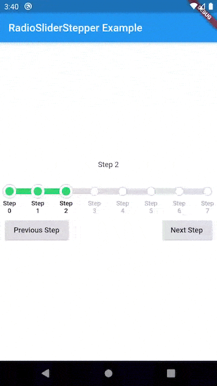

# Flutter Radio Slider Stepper

A stepped slider implementation using radio buttons for Flutter.

 

## License
Licensed under the terms of the Apache 2.0 license, the full version of which can be found in the
[LICENSE](https://raw.githubusercontent.com/adaptant-labs/flutter_radio_slider/master/LICENSE) file included in the distribution.